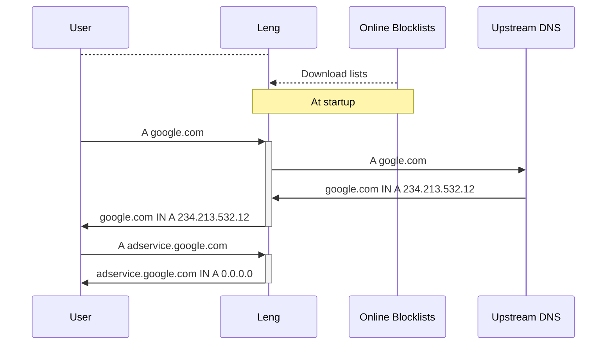

# DNS (overview)

Leng works by proxying your DNS requests to an upstream DNS server,
and returning a useless response when the request is for a blocked
domain.

Blocked domains are those that appear on a blocklist (downloaded
at startup). You can see which blocklists are enabled by default
and how to change them in [Configuration](./Configuration.md).

Additionally, you can also configure custom responses for
specific domains, indepenently of the blocklists.
See more in [Custom DNS](Custom-DNS-Records.md).

