# DNS Privacy

Leng can enhance your DNS Privacy in several ways

## As your DoH provider

[DNS-over-HTTPS](https://www.cloudflare.com/en-gb/learning/dns/dns-over-tls/)
allows encrypted, hard-to-block DNS. You can set up DNS-over-HTTPS
for most major browsers ([see how here](https://developers.cloudflare.com/1.1.1.1/encryption/dns-over-https/encrypted-dns-browsers/)).

See how to set it up for leng at [DNS-over-HTTP](DNS-over-HTTPS-(DoH).md).

## As a DoH proxy

DoH is great, but most devices use DNS-over-UDP by default, and some can't even
be configured otherwise.

If you have your own private secure network, you can stop
attackers from learning what websites you visit by using leng as
a secure proxy:

```mermaid

graph TD
    subgraph Secure Network
        U("🧘 User") --> |"🔓 Insecure\nDNS-over-UDP"|L[Leng]
    end
    L --> |"🔒 Secure DoH"| Up[Upstream DNS]
    A("👿 Attacker") ---> |Cannot see contents\nof DNS requests | Up
```

This way you allow 'insecure' DNS, but only inside your network,
and your requests are private to external attackers.

No configuration is required for this: leng will always try
to resolve domains by DoH via cloudflare before falling back to
other methods. You can choose the upstream DoH resolver in the
[Configuration](Configuration.md).

> Note that this method is only as secure as your network is!
> Ideally set up as many devices as possible to use DoH directly

## Preserving privacy against a single upstream

If you do not trust upstream providers with your privacy, ideally you should
not send all your requests to any one of them. Because of the authoritative nature of DNS, asking _some_ upstream
cannot be avoided, but the best you can do is use a fully recursive resolver like [unbound](https://github.com/NLnetLabs/unbound).
You can still use non-recursive DNS proxies (leng, blocky, or CoreDNS) and their features
by using unbound as your upstream, and letting unbound resolve your queries.

