# Deploying on Nomad

## Example Job file

You can deploy leng on Nomad. The following job file should serve as a
starting point. It includes
- ports bound to a host network `YOUR_VPN`
- services for metrics and DNS, including [DoH](DNS/DNS-over-HTTPS-(DoH).md)

It is **strongly** recommended that
- you do not expose your DNS ports to the outer internet (as you will make
yourself vulnerable to DNS amplification and DoS attacks). I recommend
you use [Nomad's `host_network` feature](https://developer.hashicorp.com/nomad/docs/job-specification/network#host_network) to select what interface to bind the ports
to.
- you bind the `dns` port to 53 in order to make it reachable. Other
ports can be reached through your preferred method of service discovery.

<details>
<summary>Drop down for Job file</summary>
<br>

```hcl
job "dns" {
  group "leng-dns" {
    network {
      mode = "bridge"
      port "dns" {
        static = 53
      }
      port "metrics" {}
      port "http_doh" {}
    }
    update {
      canary           = 1
      min_healthy_time = "30s"
      healthy_deadline = "5m"
      auto_revert      = true
      auto_promote     = true
    }

    service {
      name     = "dns-metrics"
      provider = "nomad"
      port     = "metrics"
      tags     = ["metrics"]
    }
    service {
      name     = "dns"
      provider = "nomad"
      port     = "dns"
    }
    service {
      name     = "doh"
      provider = "nomad"
      port     = "http_doh"
    }
    task "leng-dns" {
      driver = "docker"
      config {
        image = "ghcr.io/cottand/leng:sha-6b2e265"
        args = [
          "--config", "${NOMAD_ALLOC_DIR}/config.toml",
          "--update",
        ]
        ports = ["dns", "metrics"]
      }
      resources {
        cpu    = 80
        memory = 80
      }
      template {
        destination = "${NOMAD_ALLOC_DIR}/config.toml"
        change_mode = "restart"
        data = <<EOF
logconfig = "stderr@1"

# address to bind to for the DNS server
bind = "0.0.0.0:{{ env "NOMAD_PORT_dns"  }}"

# address to bind to for the API server
api = "0.0.0.0:{{ env "NOMAD_PORT_metrics"  }}"

# concurrency interval for lookups in miliseconds
interval = 200

metrics.enabled = true

[Upstream]
  nameservers = ["1.1.1.1:53", "1.0.0.1:53"]
  DoH = "https://cloudflare-dns.com/dns-query"

[DnsOverHttpServer]
	enabled = true
	bind = "0.0.0.0:{{ env "NOMAD_PORT_http_doh" }}"
	timeoutMs = 5000

	[DnsOverHttpServer.TLS]
		enabled = false

EOF
      }
    }
  }
}
```
</details>

## Service Discovery

Leng can be used as a sort of Consul replacement to implement
DNS-based service discovery - meaning you can address your
Nomad services by DNS. See the following templated config file
(you would use it inside the template above, as a replacemenet for the
provided `config.toml` file).


Example diagram for discovering a `grafana` service (SRV record omitted):

```mermaid
graph TD
    J("🐳 Nomad Job (grafana)\n at 10.0.0.3") -->|" registers `grafana` service "| N[Nomad]
    N -->|renders template| L["⚡ Leng \n `grafana.nomad. IN A 10.10.0.3` "]
    U("You (or some container)") -->|queries DNS| L
    L -->|reaches| J
```


<details>
<summary>
Templated TOML config for leng</summary>
<br>

- creates A record per Nomad client
- creates A record per service
- creates SRV record per service pointing to (port, client)
```toml
logconfig = "stderr@1"

# address to bind to for the DNS server
bind = "0.0.0.0:{{ env "NOMAD_PORT_dns"  }}"

# address to bind to for the API server
api = "0.0.0.0:{{ env "NOMAD_PORT_metrics"  }}"

metrics.enabled = true

customdnsrecords = [

    # example for your hardcoded service:
    {{ range $i, $s := nomadService "my-service" }}
    "myservice.mytld            3600  IN  A   {{ .Address }}",
    {{ end }}
    
    ## start - generation for every registered nomad service" ##

    {{ $rr_a := sprig_list -}}
    {{- $rr_srv := sprig_list -}}
    {{- $base_domain := ".nomad" -}} {{- /* Change this field for a diferent tld! */ -}}
    {{- $ttl := 3600 -}}             {{- /* Change this field for a diferent ttl! */ -}}

    {{- /* Iterate over all of the registered Nomad services */ -}}
    {{- range nomadServices -}}
        {{ $service := . }}

        {{- /* Iterate over all of the instances of a services */ -}}
        {{- range nomadService $service.Name -}}
            {{ $svc := . }}


            {{- /* Generate a uniq label for IP */ -}}
            {{- $node := $svc.Address | md5sum | sprig_trunc 8 }}

            {{- /* Record A & SRV RRs */ -}}
            {{- $rr_a = sprig_append $rr_a (sprig_list $svc.Name $svc.Address) -}}
            {{- $rr_a = sprig_append $rr_a (sprig_list $node $svc.Address) -}}
            {{- $rr_srv = sprig_append $rr_srv (sprig_list $svc.Name $svc.Port $node) -}}
        {{- end -}}
    {{- end -}}

    {{- /* Iterate over lists and print everything */ -}}

    {{- /* Only the latest record will get returned - see https://github.com/looterz/grimd/issues/114 */ -}}
    {{ range $rr_srv -}}
    "{{ printf "%-45s %s %s %d %d %6d %s" (sprig_nospace (sprig_cat (index . 0) $base_domain ".srv")) "IN" "SRV" 0 0 (index . 1) (sprig_nospace (sprig_cat (index . 2) $base_domain )) }}",
    {{ end -}}

    {{- range $rr_a | sprig_uniq -}}
    "{{ printf "%-45s %4d %s %4s %s" (sprig_nospace (sprig_cat (index . 0) $base_domain)) $ttl "IN" "A" (sprig_last . ) }}",
    {{ end -}}
```
</details>

Templating works very well with leng because of its fast
startup and small Docker image. When Nomad restarts the task
because of a change in the template, leng will be back up in seconds
or less.

## Proxy discovery with DNS-based routing

You can tweak this further to direct DNS to your ingress proxy, rather than
directly to each container.

For example, if you are using traefik,
you could:
1. Add services to traefik by default (with [defaultRule setting](https://doc.traefik.io/traefik/providers/nomad/#defaultrule)) for example:

```
# in traefik.toml
providers.nomad.defaultRule = "Host(`{{"{{ .Name }}"}}.traefik`)"`)
```
2. Add a DNS A record pointing to traefik for each service:

```toml
customdnsrecords = [
    {{- $ttl := 3600 -}}             {{- /* Change this field for a diferent ttl! */ -}}
    {{- $traefik_ip := "10.10.4.1" -}}             {{- /* Change this field to the IP of your traefik! */ -}}
    {{- range nomadServices -}}
        {{ $service := . }}

        {{- /* Iterate over all of the instances of a services */ -}}
        {{- range nomadService $service.Name -}}
            {{- /* A records to traefik IP: */ -}}
            "{{ printf "%-45s %4d %s %4s %s" (sprig_nospace (sprig_cat .Name ".traefik")) $ttl "IN" "A" $traefik_ip }}",
        {{ end }}
    {{ end }}
]
```

The end result: if you visit `grafana.traefik`, you will get directed
to the instance where traefik is running, and traefik
will proxy your request to the actual instance where the `grafana`
service is running!

Example diagram for discovering a `grafana` service:


## Acknowledgments

The templating are modified versions of [this gist](https://gist.github.com/m1keil/d0ef68c4277712a5b0ce2cf74743f18e) by m1keil.
